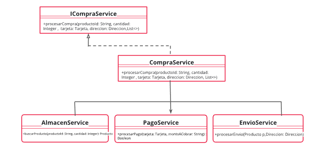

# Facade
## Teoría
#### Propósito
Facade es un patrón de diseño estructural que proporciona una interfaz simplificada a una biblioteca, un framework o cualquier otro grupo complejo de clases.

#### Solución
Se dispone de una interfaz que define como el cliente se va a comunicar con el sistema. 
Esta clase implementará esta interfaz para poder recibir las peticiones y será la encargada de enviarle la petición del cliente a la clase que corresponda (subsistemas).

#### Ventajas
* El software se vuelve más flexible y fácilmente de expandir.
* Reducimos el uso de objetos que tratan directamente con el cliente, haciendo que el sistema sea más fácil de usar.
* Reducimos el acoplamiento entre el cliente y los subsistemas. Esto nos permite modificar los subsistemas sin afectar al cliente.

#### Desventajas
* Alto grado de dependencia en la interfaz de la fachada.

## Ejercicios
### Ejercicio 1 - Compra
Supongamos que tenemos que diseñar un sistema para un e-commerce. Nuestro cliente nos pide que al momento de efectuar la venta del producto, nuestro sistema debería realizar una serie de pasos, por ejemplo: pedir el producto al almacén, acreditar el pago y enviar el pedido. 

[Resolucion](./src/CompraService)

### Ejercicio 2 - Vuelos
Cuando vamos a contratar un servicio de turismo como un vuelo o un hotel, tenemos que solicitar cada uno por separado. Vamos a crear un sistema que  permita realizar la búsqueda de hotel y vuelo en un mismo pedido. Para esto será necesario interactuar con dos sistemas.
Tenemos ya implementados los sistema de vuelo y  hoteles que poseen la funcionalidad de búsqueda según:
* Búsqueda vuelo: por fecha de salida,  fecha de regreso, origen y destino.
* Búsqueda hotel: por fecha de entrada, fecha de salida, ciudad.

Se implementará una simple fachada que permita exponer un método que realice las búsquedas, encargándose en interactuar con los sistemas de búsqueda y no tener que lidiar con la complejidad de dichos sistemas desde el método main. 
Se necesita visualizar por pantalla qué vuelos y hoteles están disponibles. Los parámetros de búsqueda son solamente la ciudad del hotel (String), que es la misma que la del destino del vuelo, y la fecha desde-donde, que es igual para la búsqueda de vuelo y hotel. 
El pedido a la fachada por lo tanto en una sola llamada incluye los otros dos.
No olvidemos implementar los casos de prueba necesarios para poder garantizar la calidad del código realizado.

[Resolucion](./src/busquedaVuelos)

### Ejercicio 3 - Tarjeta
Supongamos que tenemos que programar un sistema de cálculo de descuento en un
supermercado.
Hay descuentos acumulables (se suman los porcentajes) según:

* Por tarjeta: si es del banco Star Bank tiene un 20% de descuento extra.
* Por tipo de producto: las latas tienen un 10% de descuento.
* Por cantidad: si compran más de 12 hay un descuento del 15%.

Cada política de descuento está implementada en una API diferente:
1. ApiTarjeta: int descuento(Tarjeta)
2. ApiProducto: int descuento(Producto)
3. ApiCantidad: int descuento(cantidad)

[Resolucion](./clase8/src/tarjeta/)
