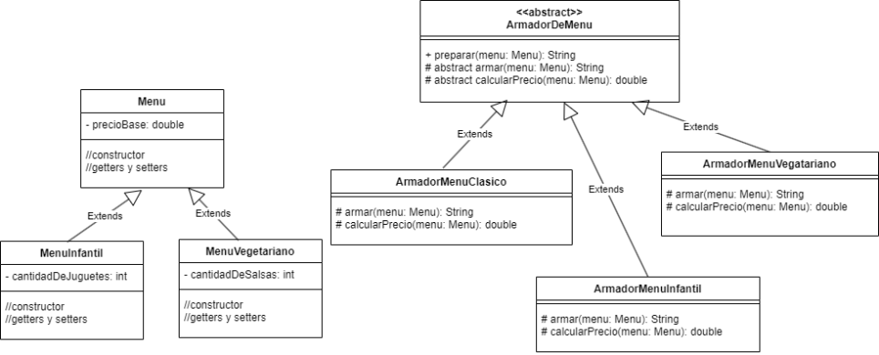

# Template Method
## Teoría
#### Propósito
Es un patrón de diseño de comportamiento que define el esqueleto de un algoritmo en la superclase, pero permite que las subclases sobrescriban pasos del algoritmo sin cambiar su estructura.

#### Solución
El método esqueleto está conformado por el código que estas clases tienen en común, permitiendo que algunas partes puedan ser modificadas por la subclase que implemente el mismo, logrando ubicar en un solo lugar el código repetido.

#### Ventajas
* Los clientes pueden sobrescribir ciertas partes de un algoritmo grande para que les afecten menos los cambios que tienen lugar en otras partes del algoritmo.
* Se puede colocar el código duplicado dentro de una superclase.

#### Desventajas
* Los métodos “esqueleto” tienden a ser más difíciles de mantener cuantos más pasos a implementar tengan
* Algunos clientes pueden verse limitados por el esqueleto proporcionado por el algoritmo.

#### Ejemplo
Veamos un ejemplo del patrón haciendo una analogía con un ejemplo de la vida real. Pensemos en una pizzería y en el proceso de preparar diferentes tipos de pizzas. Intentemos identificar los pasos que un cocinero debe realizar para cocinar y entregar una pizza. Podrían ser:  
1. Preparar masa
2. Precocinar masa
3. Preparar ingredientes
4. Agregar ingredientes
5. Cocinar 
6. Empaquetar

Por cada variedad de pizza, los cocineros tienen que hacer todos esos pasos. 
Aplicando el patrón template method, podríamos crear el método esqueleto, con los pasos comunes a todas las pizzas y dejar que los cocineros solo se preocupen por los pasos que no son comunes a todas las pizzas, en este caso, preparar los ingredientes y agregar los ingredientes. Veamos cómo representamos esta solución en un diagrama UML.

## Ejercicios
### Ejercicio 1 - menú
Se desea apoyar el proceso de armado de menús para llevar en un negocio de comidas rápidas. Se ofrecen tres tipos de menús: clásico, infantil y vegetariano.
Los menús tienen un precio base al cual se le suman los recargos de acuerdo a lo siguiente:
* **Menú infantil**: 3 pesos adicionales por cada juguete incluido.
* **Menú vegetariano**: 1% adicional por especias y 2 pesos por cada salsa vegetariana.
* **Menú clásico**: no tiene recargos.
Cuando un cliente adquiere los productos, los empleados deben armar el paquete de cada menú y luego calcular su costo. El proceso de preparar un menú implica el armado y luego su cálculo del precio de venta.
Necesitamos un sistema que muestre un mensaje a los empleados sobre cómo debe armarse el menú. De esta manera, podremos garantizar la uniformidad en las entregas. Luego, deberá informar el costo final del menú vendido.
Debemos desarrollar las clases y pruebas necesarias para lograr el proceso explicado de preparación.

[Resolucion](./Menu/src/)
